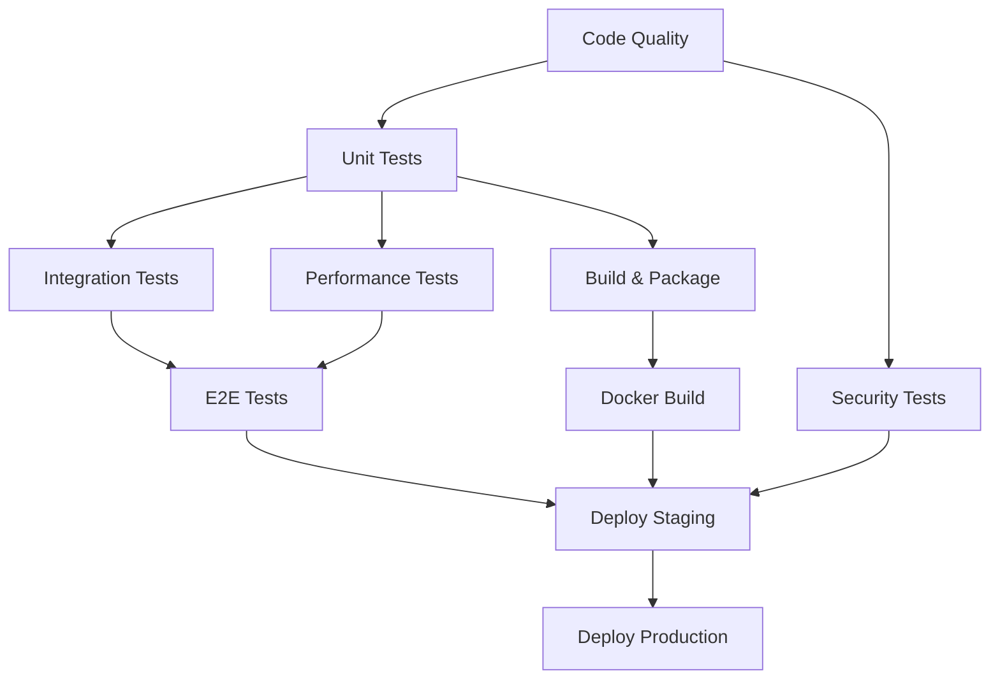

# 🚀 CI/CD Configuration for BCI-2-Token

This directory contains the complete CI/CD pipeline configuration for the BCI-2-Token project.

## 📁 Files Overview

- **`github-actions-ci.yml`** - Complete GitHub Actions workflow configuration
- **`deployment-guides/`** - Deployment guides for different platforms
- **`monitoring-configs/`** - Monitoring and observability configurations

## 🔧 Setup Instructions

### GitHub Actions Setup

To enable the CI/CD pipeline in your repository:

1. **Copy the workflow file**:
   ```bash
   mkdir -p .github/workflows
   cp ci-cd/github-actions-ci.yml .github/workflows/ci.yml
   ```

2. **Configure repository secrets** (if needed):
   - `DOCKER_USERNAME` - Docker Hub username
   - `DOCKER_PASSWORD` - Docker Hub password
   - `KUBERNETES_CONFIG` - Kubernetes cluster configuration

3. **Enable GitHub Actions** in your repository settings

### Pipeline Features

The CI/CD pipeline includes:

✅ **Code Quality Checks**
- Black code formatting
- Ruff linting  
- MyPy type checking
- Security scanning with Bandit

✅ **Comprehensive Testing**
- Unit tests across multiple Python versions
- Integration tests with Redis
- Performance benchmarking
- Security vulnerability testing
- End-to-end workflow validation

✅ **Build & Package**
- Python package building
- Docker multi-platform images
- Documentation generation

✅ **Deployment Automation**
- Staging environment deployment
- Production environment deployment
- Automated verification and rollback

### Pipeline Stages



## 🔒 Security Considerations

The pipeline includes multiple security layers:

- **Static Analysis**: Bandit security linting
- **Dependency Scanning**: Safety and pip-audit
- **Container Scanning**: Docker image vulnerability checks
- **Secrets Management**: GitHub secrets for sensitive data
- **Access Control**: Environment protection rules

## 📊 Monitoring Integration

The CI/CD pipeline integrates with:

- **Prometheus**: Metrics collection from deployments
- **Grafana**: Dashboard visualization
- **OpenTelemetry**: Distributed tracing
- **Alert Manager**: Automated alerting on failures

## 🚀 Usage Examples

### Running Tests Locally

```bash
# Install development dependencies
pip install -e .[dev]

# Run unit tests
pytest tests/ -m "unit"

# Run with coverage
pytest tests/ --cov=bci2token --cov-report=html

# Run performance tests
pytest tests/ -m "performance" --benchmark-only
```

### Building Docker Images

```bash
# Build development image
docker build --target development -t bci2token:dev .

# Build production image  
docker build --target production -t bci2token:prod .

# Run container
docker run -p 8000:8000 bci2token:prod
```

### Manual Deployment

```bash
# Deploy to staging
kubectl apply -f k8s/staging/

# Deploy to production
kubectl apply -f k8s/production/

# Check deployment status
kubectl rollout status deployment/bci2token
```

## 🛠️ Customization

### Adding New Test Types

1. Create test files with appropriate markers:
   ```python
   @pytest.mark.your_test_type
   def test_your_functionality():
       pass
   ```

2. Add new job to the workflow:
   ```yaml
   your-tests:
     name: 🔧 Your Tests
     steps:
       - name: Run your tests
         run: pytest tests/ -m "your_test_type"
   ```

### Environment-Specific Configuration

Create environment-specific configurations:

```bash
ci-cd/
├── environments/
│   ├── staging.yml
│   ├── production.yml
│   └── development.yml
```

### Custom Deployment Targets

Add new deployment targets by:

1. Creating deployment scripts in `ci-cd/scripts/`
2. Adding new jobs to the workflow
3. Configuring environment protection rules

## 📈 Performance Optimization

The pipeline is optimized for:

- **Parallel Execution**: Tests run concurrently across matrix builds
- **Caching**: Dependencies and build artifacts are cached
- **Early Failure**: Fast-failing jobs prevent unnecessary computation
- **Resource Efficiency**: Appropriate runner sizes for different jobs

## 🔧 Troubleshooting

### Common Issues

**Permission denied errors**:
```bash
# Fix file permissions
chmod +x ci-cd/scripts/*.sh
```

**Docker build failures**:
```bash
# Check Docker daemon
docker info

# Clean build cache
docker builder prune -f
```

**Test failures**:
```bash
# Run tests with verbose output
pytest tests/ -v --tb=long

# Run specific test
pytest tests/test_specific.py::test_function -v
```

### Getting Help

- Check the [Issues](https://github.com/your-org/bci-2-token/issues) for known problems
- Review the [Discussions](https://github.com/your-org/bci-2-token/discussions) for Q&A
- Contact the maintainers via [email](mailto:support@bci2token.dev)

---

**Note**: This CI/CD configuration is stored outside `.github/workflows/` to avoid GitHub App permission issues. Copy the files to the appropriate locations when setting up your repository.